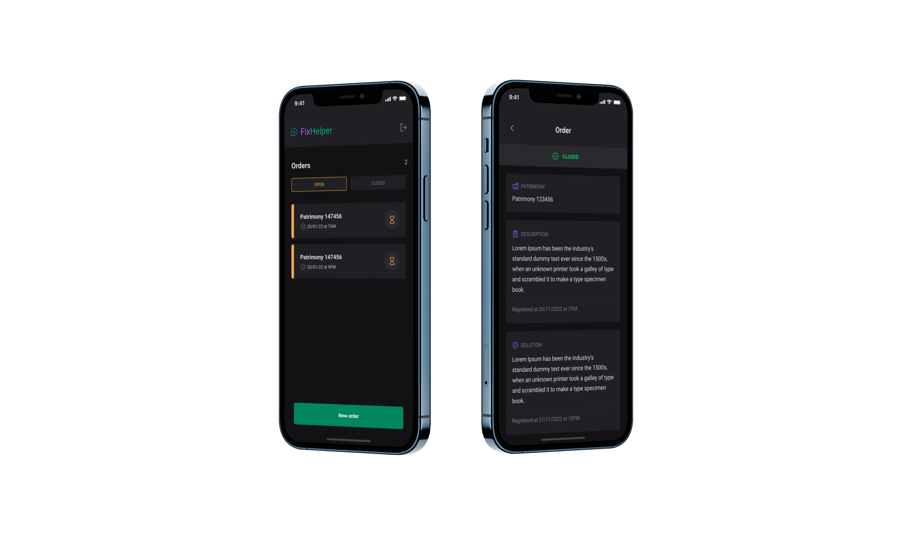

  

## About
FixHelper is a mobile app that allows you to register orders to fix equipements (e.g. computers, routers and so on).

## Technologies
### React Native

### Expo

### Typescript

### Firebase

### Native Base

## Template
You can access the Figma template [here](https://www.figma.com/file/4MUd4OeonI1Uz1N4FWDAoQ/Ignite-Lab-3.0-(Rocketseat)).

## Usage
Since this project uses Firebase to authenticate users and store the data, it's necessary to create a project on Firebase and configure the iOS and Android apps inside of your Firebase project. After configuring both apps, you'll have to download the files `google-services.json` and `GoogleService-Info.plist` from Firebase and put both of them in the root directory.

This project also uses Expo, so if you don't have the Expo CLI installed on your computer you can run `npm install -g expo-cli` or `yarn add expo-cli -g` to install it.

The last essential step is to have [Android Studio](https://developer.android.com/studio) installed and configured on your machine. If your using a Mac you will need [Xcode](https://developer.apple.com/xcode/) to run the project.

After all these steps, you can run `expo prebuild` to finish all the setups of the project and then run `expo run:android` to start the project (the emulator needs to be running before using this command). If you are a Mac user, you can run `expo run:ios` to start the project.